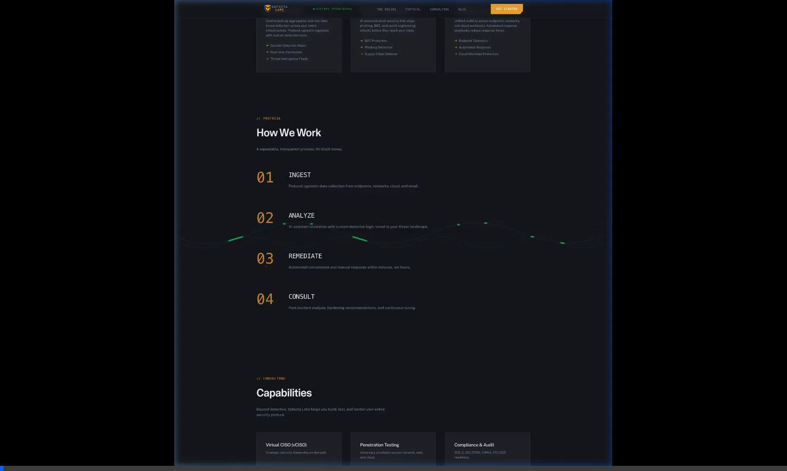

# Sofecta Labs Website 

Welcome to the **Sofecta Labs** website repository! 

This repository powers the official sofectalabs.io website. It has been built using a Next.js framework seamlessly integrated with the powerful **Netlify Visual Editor** for instantaneous, visual content management.

## Architecture Overview

*   **Framework**: Next.js
*   **Styling**: Custom CSS and utility-first layout bindings
*   **Content Modeling**: Data is structurally decoupled in `content/pages/`
*   **CMS**: Netlify Visual Editor (driven by Stackbit)

## Netlify Visual Editor Integration 

This repository uses a File-Based Content approach, meaning the actual text and references you see on the site live entirely within Markdown (`.md`) files inside the `content/` folder. This is read by the Visual Editor schema (`stackbit.config.ts`) allowing anyone on your team to edit text, buttons, and links directly on the webpage visually!

### Deploying & Connecting to Netlify

To get this site live and editable on Netlify, follow these steps:

1. **Create the Site in Netlify**: Log into your Netlify dashboard and click **Add new site** > **Import an existing project**. Connect this GitHub repository (`SofectaLabs/sofectalabs-website`).
2. **Configure Settings**: Netlify should automatically detect that this is a Next.js project.
    - Build Command: `npm run build`
    - Publish Directory: `.next`
    - Node version: Ensure your environment expects Node 16 or 18.
3. **Deploy Site**: Hit deploying! Wait for the build to turn green.
4. **Enable Visual Editor**:
    - Once deployed, navigate to your site's overview page in the Netlify Dashboard.
    - Click on the **Visual Editor** tab.
    - Because this repository already contains a valid `stackbit.config.ts` defining your components, Netlify will effortlessly generate the graphical interface for your website. 
5. **Editing the Content**: Launch the Visual Editor. You will see a live preview of your actual site. Simply hover over any text blocks (like the Hero title) or buttons, click, and edit. When you **Publish** inside the visual editor, Netlify will automatically create a commit in this repository updating the underlying Markdown text!

### Local Development

For engineers looking to modify the components, styling, or configuration:

1. Clone this repository locally.
2. Run `npm install` to install dependencies.
3. Run `npm run dev` to start the local Next.js server.
4. Navigate to `http://localhost:3000` to view the site as you build!

---
*Developed by Deepmind Agent Antigravity.*
